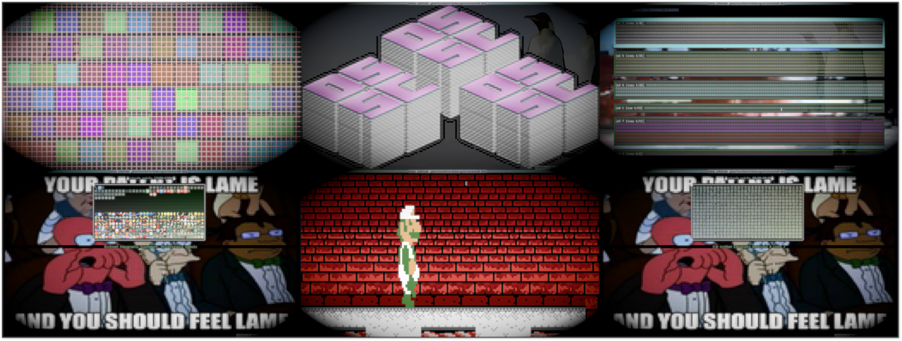

# notcurses
blingful TUI library for modern terminal emulators. definitely not curses.

by [nick black](https://nick-black.com/dankwiki/index.php/Hack_on) (<nickblack@linux.com>)

<p align="center">

</p>

[](https://drone.dsscaw.com:4443/dankamongmen/notcurses)
[](https://opensource.org/licenses/Apache-2.0)

* [Introduction](#introduction)
* [Requirements](#requirements)
* [Use](#use)
  * [Input](#input)
  * [Planes](#planes) ([Plane Channels API](#plane-channels-api), [Wide chars](#wide-chars))
  * [Cells](#cells) ([Cell Channels API](#cell-channels-api))
  * [Multimedia](#multimedia)
  * [Panelreels](#panelreels)
  * [Channels](#channels)
  * [Perf](#perf)
* [Included tools](#included-tools)
* [Differences from NCURSES](#differences-from-ncurses)
  * [Features missing relative to NCURSES](#features-missing-relative-to-ncurses)
  * [Adapting NCURSES programs](#adapting-ncurses-programs)
* [Environment notes](#environment-notes)
  * [DirectColor detection](#DirectColor-detection)
  * [Fonts](#fonts)
* [Supplemental material](#supplemental-material)
  * [Useful links](#useful-links)
  * [Other TUI libraries](#other-tui-libraries-of-note)
  * [History](#history)
  * [Thanks](#thanks)

## Introduction

* **What it is**: a library facilitating complex TUIs on modern terminal
    emulators, supporting vivid colors and Unicode to the maximum degree
    possible. Many tasks delegated to Curses can be achieved using notcurses
    (and vice versa).

* **What it is not**: a source-compatible X/Open Curses implementation, nor a
    replacement for NCURSES on existing systems, nor a widely-ported and -tested
    bedrock of free software, nor a battle-proven, veteran library.

notcurses abandons the X/Open Curses API bundled as part of the Single UNIX
Specification. The latter shows its age, and seems not capable of making use of
terminal functionality such as unindexed 24-bit color ("DirectColor", not to be
confused with 8-bit indexed 24-bit color, aka "TrueColor" or (by NCURSES) as
"extended color"). For some necessary
background, consult Thomas E. Dickey's superb and authoritative [NCURSES
FAQ](https://invisible-island.net/ncurses/ncurses.faq.html#xterm_16MegaColors).
As such, notcurses is not a drop-in Curses replacement. It is almost certainly
less portable, and definitely tested on less hardware. Sorry about that.
Ultimately, I hope to properly support all terminals *supporting the features
necessary for complex TUIs*. I would argue that teletypes etc. are
fundamentally unsuitable. Most operating systems seem reasonable targets, but I
only have Linux and FreeBSD available for testing.

Whenever possible, notcurses makes use of the Terminfo library shipped with
NCURSES, benefiting greatly from its portability and thoroughness.

notcurses opens up advanced functionality for the interactive user on
workstations, phones, laptops, and tablets, at the expense of e.g.
industrial and retail terminals (or even the Linux virtual console,
which offers only eight colors and limited glyphs).

Why use this non-standard library?

* Thread safety, and efficient use in parallel programs, has been a design
  consideration from the beginning.

* A svelter design than that codified by X/Open:
  * Exported identifiers are prefixed to avoid common namespace collisions.
  * The library object exports a minimal set of symbols. Where reasonable,
    `static inline` header-only code is used. This facilitates compiler
    optimizations, and reduces loader time.

* All APIs natively suport UTF-8. The `cell` API is based around Unicode's
  [Extended Grapheme Cluster](https://unicode.org/reports/tr29/) concept.

* Visual features including images, fonts, video, high-contrast text, sprites,
  and transparent regions. All APIs natively support 24-bit color, quantized
  down as necessary for the terminal.

* It's Apache2-licensed in its entirety, as opposed to the
  [drama in several acts](https://invisible-island.net/ncurses/ncurses-license.html)
  that is the NCURSES license (the latter is [summarized](https://invisible-island.net/ncurses/ncurses-license.html#issues_freer)
  as "a restatement of MIT-X11").

Much of the above can be had with NCURSES, but they're not what NCURSES was
*designed* for. The most fundamental advantage in my mind, though, is
that notcurses is of the multithreaded era. On the other hand, if you're
targeting industrial or critical applications, or wish to benefit from the
time-tested reliability and portability of Curses, you should by all means use
that fine library.

## Requirements

* A C11 and a C++14 compiler
* CMake 3.13.0+
* From NCURSES: terminfo 6.1+
* From FFMpeg: libswscale 5.0+, libavformat 57.0+, libavutil 56.0+

## Use

A program wishing to use notcurses will need to link it, ideally using the
output of `pkg-config --libs notcurses`. It is advised to compile with the
output of `pkg-config --cflags notcurses`. If using CMake, a support file is
provided, and can be accessed as `notcurses`.

Before calling into notcurses—and usually as one of the first calls of the
program—be sure to call `setlocale(3)` with an appropriate UTF-8 `LC_ALL`
locale. It is usually appropriate to use `setlocale(LC_ALL, "")`, relying on
the user to properly set the `LANG` environment variable. notcurses will
refuse to start if `nl_langinfo(3)` doesn't indicate UTF-8.

notcurses requires an available `terminfo(5)` definition appropriate for the
terminal. It is usually appropriate to pass `NULL` in the `termtype` field of a
`notcurses_options` struct, relying on the user to properly set the `TERM`
environment variable. This variable is usually set by the terminal itself. It
might be necessary to manually select a higher-quality definition for your
terminal, i.e. `xterm-direct` as opposed to `xterm` or `xterm-256color`.

Each terminal can be prepared via a call to `notcurses_init()`, which is
supplied a struct of type `notcurses_options`:

```c
// Get a human-readable string describing the running notcurses version.
const char* notcurses_version(void);

struct cell;      // a coordinate on an ncplane: an EGC plus styling
struct ncplane;   // a drawable notcurses surface, composed of cells
struct notcurses; // notcurses state for a given terminal, composed of ncplanes

// Configuration for notcurses_init().
typedef struct notcurses_options {
  // The name of the terminfo database entry describing this terminal. If NULL,
  // the environment variable TERM is used. Failure to open the terminal
  // definition will result in failure to initialize notcurses.
  const char* termtype;
  // If smcup/rmcup capabilities are indicated, notcurses defaults to making
  // use of the "alternate screen". This flag inhibits use of smcup/rmcup.
  bool inhibit_alternate_screen;
  // By default, we hide the cursor if possible. This flag inhibits use of
  // the civis capability, retaining the cursor.
  bool retain_cursor;
  // We typically install a signal handler for SIGINT and SIGQUIT that restores
  // the screen, and then calls the old signal handler. Set this to inhibit
  // registration of any signal handlers.
  bool no_quit_sighandlers;
  // We typically install a signal handler for SIGWINCH that generates a resize
  // event in the notcurses_getc() queue. Set this to inhibit the handler.
  bool no_winch_sighandler;
  // Notcurses typically prints version info in notcurses_init() and
  // performance info in notcurses_stop(). This inhibits that output.
  bool suppress_bannner;
  // If non-NULL, notcurses_render() will write each rendered frame to this
  // FILE* in addition to outfp. This is used primarily for debugging.
  FILE* renderfp;
} notcurses_options;

// Initialize a notcurses context on the connected terminal at 'fp'. 'fp' must
// be a tty. You'll usually want stdout. Returns NULL on error, including any
// failure to initialize terminfo.
struct notcurses* notcurses_init(const notcurses_options* opts, FILE* fp);

// Destroy a notcurses context.
int notcurses_stop(struct notcurses* nc);
```

`notcurses_stop` should be called before exiting your program to restore the
terminal settings and free resources.

The notcurses API draws almost entirely into the virtual buffers of `ncplane`s.
Only upon a call to `notcurses_render` will the visible terminal display be
updated to reflect the changes:

```c
// Make the physical screen match the virtual screen. Changes made to the
// virtual screen (i.e. most other calls) will not be visible until after a
// successful call to notcurses_render().
int notcurses_render(struct notcurses* nc);
```

One `ncplane` is guaranteed to exist: the "standard plane". The user cannot
move, resize, reparent, or destroy the standard plane (it *can* be erased).
Its dimensions always match notcurses's conception of the visible terminal. A
handle on the standard plane can be acquired with two top-level functions:

```c
// Get a reference to the standard plane (one matching our current idea of the
// terminal size) for this terminal. The standard plane always exists, and its
// origin is always at the uppermost, leftmost cell of the screen.
struct ncplane* notcurses_stdplane(struct notcurses* nc);
const struct ncplane* notcurses_stdplane_const(const struct notcurses* nc);
```

A reference to the standard plane *is* persistent across a screen resize, as are
any indexes into its egcpool, but its framebuffer *is not* necessarily
persistent across a screen resize. Thankfully, you shouldn't have a reference
to its framebuffer, and thus only the change to its dimensions can really catch
you off guard.

Utility functions operating on the toplevel `notcurses` object include:

```c
// Return the topmost ncplane, of which there is always at least one.
struct ncplane* notcurses_top(struct notcurses* n);

// Refresh our idea of the terminal's dimensions, reshaping the standard plane
// if necessary. Without a call to this function following a terminal resize
// (as signaled via SIGWINCH), notcurses_render() might not function properly.
// References to ncplanes (and the egcpools underlying cells) remain valid
// following a resize operation, but the cursor might have changed position.
int notcurses_resize(struct notcurses* n, int* RESTRICT y, int* RESTRICT x);

// Return our current idea of the terminal dimensions in rows and cols.
static inline void
notcurses_term_dim_yx(const struct notcurses* n, int* RESTRICT rows,
                      int* RESTRICT cols){
  ncplane_dim_yx(notcurses_stdplane_const(n), rows, cols);
}

// Refresh the physical screen to match what was last rendered (i.e., without
// reflecting any changes since the last call to notcurses_render()). This is
// primarily useful if the screen is externally corrupted.
int notcurses_refresh(struct notcurses* n);

// Create a new ncplane at the specified offset (relative to the standard plane)
// and the specified size. The number of rows and columns must both be positive.
// This plane is initially at the top of the z-buffer, as if ncplane_move_top()
// had been called on it. The void* 'opaque' can be retrieved (and reset) later.
struct ncplane* notcurses_newplane(struct notcurses* nc, int rows, int cols,
                                   int yoff, int xoff, void* opaque);

// Returns a 16-bit bitmask in the LSBs of supported curses-style attributes
// (CELL_STYLE_UNDERLINE, CELL_STYLE_BOLD, etc.) The attribute is only
// indicated as supported if the terminal can support it together with color.
// For more information, see the "ncv" capability in terminfo(5).
unsigned notcurses_supported_styles(const struct notcurses* nc);

// Returns the number of simultaneous colors claimed to be supported, or 1 if
// there is no color support. Note that several terminal emulators advertise
// more colors than they actually support, downsampling internally.
int notcurses_palette_size(const struct notcurses* nc);
```

### Input

Input can currently be taken only from `stdin`, but on the plus side, stdin
needn't be a terminal device (unlike the ttyfp `FILE*` passed to `notcurses_init()`).
Generalized input ought happen soon. There is only one input queue per `struct
notcurses`.

Like NCURSES, notcurses will watch for escape sequences, check them against the
terminfo database, and return them as special keys (we hijack the Private Use
Area for special keys, specifically Supplementary Private Use Area B (u100000
through u10ffffd). Unlike NCURSES, the fundamental unit of input is the
UTF8-encoded Unicode codepoint. Note, however, that only one codepoint is
returned at a time (as opposed to an entire EGC).

It is generally possible for a false positive to occur, wherein keypresses
intended to be distinct are combined into an escape sequence. False negatives
where an intended escape sequence are read as an ESC key followed by distinct
keystrokes are also possible. NCURSES provides the `ESCDELAY` variable to
control timing. notcurses brooks no delay; all characters of an escape sequence
must be readable without delay for it to be interpreted as such.

```c
// All input is currently taken from stdin, though this will likely change. We
// attempt to read a single UTF8-encoded Unicode codepoint, *not* an entire
// Extended Grapheme Cluster. It is also possible that we will read a special
// keypress, i.e. anything that doesn't correspond to a Unicode codepoint (e.g.
// arrow keys, function keys, screen resize events, etc.). These are mapped
// into Unicode's Supplementary Private Use Area-B, starting at U+100000.
//
// notcurses_getc() and notcurses_getc_nblock() are both nonblocking.
// notcurses_getc_blocking() blocks until a codepoint or special key is read,
// or until interrupted by a signal.
//
// In the case of a valid read, a 32-bit Unicode codepoint is returned. 0 is
// returned to indicate that no input was available, but only by
// notcurses_getc(). Otherwise (including on EOF) (char32_t)-1 is returned.

// is this wide character a Supplementary Private Use Area-B codepoint?
static inline bool
wchar_supppuab_p(char32_t w){
  return w >= 0x100000 && w <= 0x10fffd;
}

#define suppuabize(w) ((w) + 0x100000)

// Special composed key defintions. These values are added to 0x100000.
#define NCKEY_INVALID suppuabize(0)
#define NCKEY_RESIZE  suppuabize(1) // generated interally in response to SIGWINCH
#define NCKEY_UP      suppuabize(2)
#define NCKEY_RIGHT   suppuabize(3)
#define NCKEY_DOWN    suppuabize(4)
#define NCKEY_LEFT    suppuabize(5)
#define NCKEY_INS     suppuabize(6)
#define NCKEY_DEL     suppuabize(7)
#define NCKEY_BACKSPACE suppuabize(8) // backspace (sometimes)
#define NCKEY_PGDOWN  suppuabize(9)
#define NCKEY_PGUP    suppuabize(10)
#define NCKEY_HOME    suppuabize(11)
#define NCKEY_END     suppuabize(12)
#define NCKEY_F00     suppuabize(20)
#define NCKEY_F01     suppuabize(21)
#define NCKEY_F02     suppuabize(22)
#define NCKEY_F03     suppuabize(23)
#define NCKEY_F04     suppuabize(24)
#define NCKEY_F05     suppuabize(25)
#define NCKEY_F06     suppuabize(26)
#define NCKEY_F07     suppuabize(27)
#define NCKEY_F08     suppuabize(28)
#define NCKEY_F09     suppuabize(29)
#define NCKEY_F10     suppuabize(30)
// ... leave room for up to 100 function keys, egads
#define NCKEY_ENTER   suppuabize(121)
#define NCKEY_CLS     suppuabize(122) // "clear-screen or erase"
#define NCKEY_DLEFT   suppuabize(123) // down + left on keypad
#define NCKEY_DRIGHT  suppuabize(124)
#define NCKEY_ULEFT   suppuabize(125) // up + left on keypad
#define NCKEY_URIGHT  suppuabize(126)
#define NCKEY_CENTER  suppuabize(127) // the most truly neutral of keypresses
#define NCKEY_BEGIN   suppuabize(128)
#define NCKEY_CANCEL  suppuabize(129)
#define NCKEY_CLOSE   suppuabize(130)
#define NCKEY_COMMAND suppuabize(131)
#define NCKEY_COPY    suppuabize(132)
#define NCKEY_EXIT    suppuabize(133)
#define NCKEY_PRINT   suppuabize(134)
#define NCKEY_REFRESH suppuabize(135)

// See ppoll(2) for more detail. Provide a NULL 'ts' to block at length, a 'ts'
// of 0 for non-blocking operation, and otherwise a timespec to bound blocking.
// Signals in sigmask (less several we handle internally) will be atomically
// masked and unmasked per ppoll(2). It should generally contain all signals.
// Returns a single Unicode code point, or (char32_t)-1 on error. 'sigmask' may
// be NULL.
char32_t notcurses_getc(struct notcurses* n, const struct timespec* ts, sigset_t* sigmask);

static inline char32_t
notcurses_getc_nblock(struct notcurses* n){
  sigset_t sigmask;
  sigfillset(&sigmask);
  struct timespec ts = { .tv_sec = 0, .tv_nsec = 0 };
  return notcurses_getc(n, &ts, &sigmask);
}

static inline char32_t
notcurses_getc_blocking(struct notcurses* n){
  sigset_t sigmask;
  sigemptyset(&sigmask);
  return notcurses_getc(n, NULL, &sigmask);
}
```

### Planes

Fundamental to notcurses is a z-buffer of rectilinear virtual screens, known
as `ncplane`s. An `ncplane` can be larger than the physical screen, or smaller,
or the same size; it can be entirely contained within the physical screen, or
overlap in part, or lie wholly beyond the boundaries, never to be rendered.
Each `ncplane` has a current writing state (cursor position, foreground and
background color, etc.), a backing array of `cell`s, and a z-index. If
opaque, a `cell` on a higher `ncplane` completely obstructs a corresponding `cell`
from a lower `ncplane` from being seen. An `ncplane` corresponds loosely to an
[NCURSES Panel](https://invisible-island.net/ncurses/ncurses-intro.html#panels),
but is the primary drawing surface of notcurses—there is no object
corresponding to a bare NCURSES `WINDOW`.

```c
// Resize the specified ncplane. The four parameters 'keepy', 'keepx',
// 'keepleny', and 'keeplenx' define a subset of the ncplane to keep,
// unchanged. This may be a section of size 0, though none of these four
// parameters may be negative. 'keepx' and 'keepy' are relative to the ncplane.
// They must specify a coordinate within the ncplane's totality. 'yoff' and
// 'xoff' are relative to 'keepy' and 'keepx', and place the upper-left corner
// of the resized ncplane. Finally, 'ylen' and 'xlen' are the dimensions of the
// ncplane after resizing. 'ylen' must be greater than or equal to 'keepleny',
// and 'xlen' must be greater than or equal to 'keeplenx'. It is an error to
// attempt to resize the standard plane. If either of 'keepleny' or 'keeplenx'
// is non-zero, both must be non-zero.
//
// Essentially, the kept material does not move. It serves to anchor the
// resized plane. If there is no kept material, the plane can move freely.
int ncplane_resize(struct ncplane* n, int keepy, int keepx, int keepleny,
                       int keeplenx, int yoff, int xoff, int ylen, int xlen);

// Destroy the specified ncplane. None of its contents will be visible after
// the next call to notcurses_render(). It is an error to attempt to destroy
// the standard plane.
int ncplane_destroy(struct ncplane* ncp);

// Move this plane relative to the standard plane. It is an error to attempt to
// move the standard plane.
int ncplane_move_yx(struct ncplane* n, int y, int x);

// Get the origin of this plane relative to the standard plane.
void ncplane_yx(const struct ncplane* n, int* RESTRICT y, int* RESTRICT x);

// Returns the dimensions of this ncplane.
void ncplane_dim_yx(const struct ncplane* n, int* RESTRICT rows,
                        int* RESTRICT cols);

// Erase every cell in the ncplane, resetting all attributes to normal, all
// colors to the default color, and all cells to undrawn. All cells associated
// with this ncplane are invalidated, and must not be used after the call,
// excluding the default cell.
void ncplane_erase(struct ncplane* n);

// Set the specified style bits for the ncplane 'n', whether they're actively
// supported or not.
void ncplane_styles_set(struct ncplane* n, unsigned stylebits);

// Add the specified styles to the ncplane's existing spec.
void ncplane_styles_on(struct ncplane* n, unsigned stylebits);

// Remove the specified styles from the ncplane's existing spec.
void ncplane_styles_off(struct ncplane* n, unsigned stylebits);

// Return the current styling for this ncplane.
unsigned ncplane_styles(const struct ncplane* n);

// Return the ncplane below this one, or NULL if this is at the stack's bottom.
struct ncplane* ncplane_below(struct ncplane* n);
```

If a given cell's glyph is zero, or its foreground channel is fully transparent,
it is considered to have no foreground. A _default_ cell can be chosen for the
`ncplane`, to be consulted in this case. If the default cell's glyph is likewise
zero (or its foreground channel fully transparent), the plane's foreground is
not rendered. Note that the default cell, like every other cell, has its own
foreground and background channels.

```c
// Set the ncplane's default cell to this cell. If defined, it will be rendered
// anywhere that the ncplane's gcluster is 0. Erasing the ncplane does not
// reset the default cell; this function must instead be called with a zero c.
int ncplane_set_default(struct ncplane* ncp, const cell* c);

// Extract the ncplane's default cell into 'c'.
int ncplane_default(struct ncplane* ncp, cell* c);
```

`ncplane`s are completely ordered along an imaginary z-axis. Newly-created
`ncplane`s are on the top of the stack. They can be freely reordered.

```c
// Splice ncplane 'n' out of the z-buffer, and reinsert it at the top or bottom.
int ncplane_move_top(struct ncplane* n);
int ncplane_move_bottom(struct ncplane* n);

// Splice ncplane 'n' out of the z-buffer, and reinsert it below 'below'.
int ncplane_move_below(struct ncplane* RESTRICT n, struct ncplane* RESTRICT below);

// Splice ncplane 'n' out of the z-buffer, and reinsert it above 'above'.
int ncplane_move_above(struct ncplane* RESTRICT n, struct ncplane* RESTRICT above);
```

Each plane holds a user pointer which can be retrieved and set (or ignored). In
addition, the plane's virtual framebuffer can be accessed (note that this does
not necessarily reflect anything on the actual screen).

```c
// Retrieve the cell at the cursor location on the specified plane, returning
// it in 'c'. This copy is safe to use until the ncplane is destroyed/erased.
int ncplane_at_cursor(struct ncplane* n, cell* c);

// Retrieve the cell at the specified location on the specified plane, returning
// it in 'c'. This copy is safe to use until the ncplane is destroyed/erased.
int ncplane_at_yx(struct ncplane* n, int y, int x, cell* c);

// Manipulate the opaque user pointer associated with this plane.
// ncplane_set_userptr() returns the previous userptr after replacing
// it with 'opaque'. the others simply return the userptr.
void* ncplane_set_userptr(struct ncplane* n, void* opaque);
void* ncplane_userptr(struct ncplane* n);
const void* ncplane_userptr_const(const struct ncplane* n);
```

All output is to `ncplane`s. There is no cost in moving the cursor around the
virtual framebuffer. Output that's never rendered still has some memory transfer
cost as the virtual framebuffer is prepared, but new data overwrites it in
memory.

```c
// Move the cursor to the specified position (the cursor needn't be visible).
// Returns -1 on error, including negative parameters, or ones exceeding the
// plane's dimensions.
int ncplane_cursor_move_yx(struct ncplane* n, int y, int x);

// Get the current position of the cursor within n. y and/or x may be NULL.
void ncplane_cursor_yx(const struct ncplane* n, int* RESTRICT y,
                           int* RESTRICT x);

// Replace the cell underneath the cursor with the provided cell 'c', and
// advance the cursor by the width of the cell (but not past the end of the
// plane). On success, returns the number of columns the cursor was advanced.
// On failure, -1 is returned.
int ncplane_putc(struct ncplane* n, const cell* c);

// Call ncplane_putc() after successfully moving to y, x on the specified plane.
static inline int
ncplane_putc_yx(struct ncplane* n, int y, int x, const cell* c){
  if(ncplane_cursor_move_yx(n, y, x)){
    return -1;
  }
  return ncplane_putc(n, c);
}

// Replace the cell underneath the cursor with the provided 7-bit char 'c',
// using the specified 'attr' and 'channels' for styling. Advance the cursor by
// 1. On success, returns 1. On failure, returns -1. This works whether the
// underlying char is signed or unsigned.
int ncplane_putsimple(struct ncplane* n, char c, uint32_t attr, uint64_t channels);

// Call ncplane_simple() after successfully moving to y, x.
static inline int
ncplane_putsimple_yx(struct ncplane* n, int y, int x, char c,
                     uint32_t attr, uint64_t channels){
  if(ncplane_cursor_move_yx(n, y, x)){
    return -1;
  }
  return ncplane_putsimple(n, c, attr, channels);
}

// Replace the cell underneath the cursor with the provided EGC, using the
// specified 'attr' and 'channels' for styling, and advance the cursor by the
// width of the cluster (but not past the end of the plane). On success, returns
// the number of columns the cursor was advanced. On failure, -1 is returned.
// The number of bytes converted from gclust is written to 'sbytes' if non-NULL.
int ncplane_putegc(struct ncplane* n, const char* gclust, uint32_t attr,
                       uint64_t channels, int* sbytes);

// Call ncplane_putegc() after successfully moving to y, x.
static inline int
ncplane_putegc_yx(struct ncplane* n, int y, int x, const char* gclust, uint32_t attr,
                  uint64_t channels, int* sbytes){
  if(ncplane_cursor_move_yx(n, y, x)){
    return -1;
  }
  return ncplane_putegc(n, gclust, attr, channels, sbytes);
}

#define WCHAR_MAX_UTF8BYTES 6

// ncplane_putegc(), but following a conversion from wchar_t to UTF-8 multibyte.
static inline int
ncplane_putwegc(struct ncplane* n, const wchar_t* gclust, uint32_t attr,
                uint64_t channels, int* sbytes){
  // maximum of six UTF8-encoded bytes per wchar_t
  const size_t mbytes = (wcslen(gclust) * WCHAR_MAX_UTF8BYTES) + 1;
  char* mbstr = (char*)malloc(mbytes); // need cast for c++ callers
  if(mbstr == NULL){
    return -1;
  }
  size_t s = wcstombs(mbstr, gclust, mbytes);
  if(s == (size_t)-1){
    free(mbstr);
    return -1;
  }
  int ret = ncplane_putegc(n, mbstr, attr, channels, sbytes);
  free(mbstr);
  return ret;
}

// Call ncplane_putwegc() after successfully moving to y, x.
static inline int
ncplane_putwegc_yx(struct ncplane* n, int y, int x, const wchar_t* gclust,
                   uint32_t attr, uint64_t channels, int* sbytes){
  if(ncplane_cursor_move_yx(n, y, x)){
    return -1;
  }
  return ncplane_putwegc(n, gclust, attr, channels, sbytes);
}

// Write a series of EGCs to the current location, using the current style.
// They will be interpreted as a series of columns (according to the definition
// of ncplane_putc()). Advances the cursor by some positive number of cells
// (though not beyond the end of the plane); this number is returned on success.
// On error, a non-positive number is returned, indicating the number of cells
// which were written before the error.
int ncplane_putstr(struct ncplane* n, const char* gclustarr);

static inline int
ncplane_putstr_yx(struct ncplane* n, int y, int x, const char* gclustarr){
  if(ncplane_cursor_move_yx(n, y, x)){
    return -1;
  }
  return ncplane_putstr(n, gclustarr);
}

// ncplane_putstr(), but following a conversion from wchar_t to UTF-8 multibyte.
static inline int
ncplane_putwstr(struct ncplane* n, const wchar_t* gclustarr){
  // maximum of six UTF8-encoded bytes per wchar_t
  const size_t mbytes = (wcslen(gclustarr) * WCHAR_MAX_UTF8BYTES) + 1;
  char* mbstr = (char*)malloc(mbytes); // need cast for c++ callers
  if(mbstr == NULL){
    return -1;
  }
  size_t s = wcstombs(mbstr, gclustarr, mbytes);
  if(s == (size_t)-1){
    free(mbstr);
    return -1;
  }
  int ret = ncplane_putstr(n, mbstr);
  free(mbstr);
  return ret;
}

static inline int
ncplane_putwstr_yx(struct ncplane* n, int y, int x, const wchar_t* gclustarr){
  if(ncplane_cursor_move_yx(n, y, x)){
    return -1;
  }
  return ncplane_putwstr(n, gclustarr);
}

// The ncplane equivalents of printf(3) and vprintf(3).
int ncplane_printf(struct ncplane* n, const char* format, ...)
  __attribute__ ((format (printf, 2, 3)));

int ncplane_printf_yx(struct ncplane* n, int y, int x, const char* format, ...)
  __attribute__ ((format (printf, 4, 5)));

int ncplane_vprintf(struct ncplane* n, const char* format, va_list ap);

static inline int
ncplane_vprintf_yx(struct ncplane* n, int y, int x, const char* format, va_list ap){
  if(ncplane_cursor_move_yx(n, y, x)){
    return -1;
  }
  return ncplane_vprintf(n, format, ap);
}
```

Lines and boxes can be drawn, interpolating their colors between their two
endpoints. For a line of a single color, be sure to specify the same channels
on both sides. Boxes allow fairly detailed specification of how they're drawn.

```c
// Draw horizontal or vertical lines using the specified cell, starting at the
// current cursor position. The cursor will end at the cell following the last
// cell output (even, perhaps counter-intuitively, when drawing vertical
// lines), just as if ncplane_putc() was called at that spot. Return the
// number of cells drawn on success. On error, return the negative number of
// cells drawn.
int ncplane_hline_interp(struct ncplane* n, const cell* c, int len,
                             uint64_t c1, uint64_t c2);

static inline int
ncplane_hline(struct ncplane* n, const cell* c, int len){
  return ncplane_hline_interp(n, c, len, c->channels, c->channels);
}

int ncplane_vline_interp(struct ncplane* n, const cell* c, int len,
                             uint64_t c1, uint64_t c2);

static inline int
ncplane_vline(struct ncplane* n, const cell* c, int len){
  return ncplane_vline_interp(n, c, len, c->channels, c->channels);
}

// Draw a box with its upper-left corner at the current cursor position, and its
// lower-right corner at 'ystop'x'xstop'. The 6 cells provided are used to draw the
// upper-left, ur, ll, and lr corners, then the horizontal and vertical lines.
// 'ctlword' is defined in the least significant byte, where bits [7, 4] are a
// gradient mask, and [3, 0] are a border mask:
//  * 7, 3: top
//  * 6, 2: right
//  * 5, 1: bottom
//  * 4, 0: left
// If the gradient bit is not set, the styling from the hl/vl cells is used for
// the horizontal and vertical lines, respectively. If the gradient bit is set,
// the color is linearly interpolated between the two relevant corner cells.
//
// By default, vertexes are drawn whether their connecting edges are drawn or
// not. The value of the bits corresponding to NCBOXCORNER_MASK control this,
// and are interpreted as the number of connecting edges necessary to draw a
// given corner. At 0 (the default), corners are always drawn. At 3, corners
// are never drawn (as at most 2 edges can touch a box's corner).

#define NCBOXMASK_TOP    0x0001
#define NCBOXMASK_RIGHT  0x0002
#define NCBOXMASK_BOTTOM 0x0004
#define NCBOXMASK_LEFT   0x0008
#define NCBOXGRAD_TOP    0x0010
#define NCBOXGRAD_RIGHT  0x0020
#define NCBOXGRAD_BOTTOM 0x0040
#define NCBOXGRAD_LEFT   0x0080
#define NCBOXCORNER_MASK 0x0300
#define NCBOXCORNER_SHIFT 8u

int ncplane_box(struct ncplane* n, const cell* ul, const cell* ur,
                    const cell* ll, const cell* lr, const cell* hline,
                    const cell* vline, int ystop, int xstop,
                    unsigned ctlword);

// Draw a box with its upper-left corner at the current cursor position, having
// dimensions 'ylen'x'xlen'. See ncplane_box() for more information. The
// minimum box size is 2x2, and it cannot be drawn off-screen.
static inline int
ncplane_box_sized(struct ncplane* n, const cell* ul, const cell* ur,
                  const cell* ll, const cell* lr, const cell* hline,
                  const cell* vline, int ylen, int xlen, unsigned ctlword){
  int y, x;
  ncplane_cursor_yx(n, &y, &x);
  return ncplane_box(n, ul, ur, ll, lr, hline, vline, y + ylen - 1,
                     x + xlen - 1, ctlword);
}

static inline int
ncplane_rounded_box(struct ncplane* n, uint32_t attr, uint64_t channels,
                    int ystop, int xstop, unsigned ctlword){
  int ret = 0;
  cell ul = CELL_TRIVIAL_INITIALIZER, ur = CELL_TRIVIAL_INITIALIZER;
  cell ll = CELL_TRIVIAL_INITIALIZER, lr = CELL_TRIVIAL_INITIALIZER;
  cell hl = CELL_TRIVIAL_INITIALIZER, vl = CELL_TRIVIAL_INITIALIZER;
  if((ret = cells_rounded_box(n, attr, channels, &ul, &ur, &ll, &lr, &hl, &vl)) == 0){
    ret = ncplane_box(n, &ul, &ur, &ll, &lr, &hl, &vl, ystop, xstop, ctlword);
  }
  cell_release(n, &ul); cell_release(n, &ur);
  cell_release(n, &ll); cell_release(n, &lr);
  cell_release(n, &hl); cell_release(n, &vl);
  return ret;
}

static inline int
ncplane_rounded_box_sized(struct ncplane* n, uint32_t attr, uint64_t channels,
                          int ylen, int xlen, unsigned ctlword){
  int y, x;
  ncplane_cursor_yx(n, &y, &x);
  return ncplane_rounded_box(n, attr, channels, y + ylen - 1,
                             x + xlen - 1, ctlword);
}

static inline int
ncplane_double_box(struct ncplane* n, uint32_t attr, uint64_t channels,
                   int ystop, int xstop, unsigned ctlword){
  int ret = 0;
  cell ul = CELL_TRIVIAL_INITIALIZER, ur = CELL_TRIVIAL_INITIALIZER;
  cell ll = CELL_TRIVIAL_INITIALIZER, lr = CELL_TRIVIAL_INITIALIZER;
  cell hl = CELL_TRIVIAL_INITIALIZER, vl = CELL_TRIVIAL_INITIALIZER;
  if((ret = cells_double_box(n, attr, channels, &ul, &ur, &ll, &lr, &hl, &vl)) == 0){
    ret = ncplane_box(n, &ul, &ur, &ll, &lr, &hl, &vl, ystop, xstop, ctlword);
  }
  cell_release(n, &ul); cell_release(n, &ur);
  cell_release(n, &ll); cell_release(n, &lr);
  cell_release(n, &hl); cell_release(n, &vl);
  return ret;
}

static inline int
ncplane_double_box_sized(struct ncplane* n, uint32_t attr, uint64_t channels,
                         int ylen, int xlen, unsigned ctlword){
  int y, x;
  ncplane_cursor_yx(n, &y, &x);
  return ncplane_double_box(n, attr, channels, y + ylen - 1,
                            x + xlen - 1, ctlword);
}
```

My 14 year-old self would never forgive me if we didn't have sweet palette fades.

```c
// Fade the ncplane out over the provided time, calling the specified function
// when done. Requires a terminal which supports direct color, or at least
// palette modification (if the terminal uses a palette, our ability to fade
// planes is limited, and affected by the complexity of the rest of the screen).
// It is not safe to resize or destroy the plane during the fadeout FIXME.
int ncplane_fadeout(struct ncplane* n, const struct timespec* ts);

// Fade the ncplane in over the specified time. Load the ncplane with the
// target cells without rendering, then call this function. When it's done, the
// ncplane will have reached the target levels, starting from zeroes.
int ncplane_fadein(struct ncplane* n, const struct timespec* ts);
```

Aligned forms are available for `ncplane_putstr()` and `ncplane_putwstr()`.
These forms correctly take double-column glyphs into account.

```c
// Alignment within the ncplane. Left/right-justified, or centered.
typedef enum {
  NCALIGN_LEFT,
  NCALIGN_CENTER,
  NCALIGN_RIGHT,
} ncalign_e;

int ncplane_putstr_aligned(struct ncplane* n, int y, const char* s,
                           ncalign_e atype);

int ncplane_putwstr_aligned(struct ncplane* n, int y,
                            const wchar_t* gclustarr, ncalign_e atype);
```

#### Plane channels API

Helpers are provided to manipulate an `ncplane`'s `channels` member. They are
all implemented in terms of the lower-level [Channels API](#channels).

```c
// Get the current channels or attribute word for ncplane 'n'.
API uint64_t ncplane_get_channels(const struct ncplane* n);
API uint32_t ncplane_get_attr(const struct ncplane* n);

// Extract the 32-bit working background channel from an ncplane.
static inline unsigned
ncplane_get_bchannel(const struct ncplane* nc){
  return channels_get_bchannel(ncplane_get_channels(nc));
}

// Extract the 32-bit working foreground channel from an ncplane.
static inline unsigned
ncplane_get_fchannel(const struct ncplane* nc){
  return channels_get_fchannel(ncplane_get_channels(nc));
}

// Extract 24 bits of working foreground RGB from an ncplane, shifted to LSBs.
static inline unsigned
ncplane_get_fg(const struct ncplane* nc){
  return channels_get_fg(ncplane_get_channels(nc));
}

// Extract 24 bits of working background RGB from an ncplane, shifted to LSBs.
static inline unsigned
ncplane_get_bg(const struct ncplane* nc){
  return channels_get_bg(ncplane_get_channels(nc));
}

// Extract 2 bits of foreground alpha from 'struct ncplane', shifted to LSBs.
static inline unsigned
ncplane_get_fg_alpha(const struct ncplane* nc){
  return channels_get_fg_alpha(ncplane_get_channels(nc));
}
/ Extract 2 bits of background alpha from 'struct ncplane', shifted to LSBs.
static inline unsigned
ncplane_get_bg_alpha(const struct ncplane* nc){
  return channels_get_bg_alpha(ncplane_get_channels(nc));
}

// Set the alpha parameters for ncplane 'n'.
int ncplane_set_fg_alpha(struct ncplane* n, int alpha);
int ncplane_set_bg_alpha(struct ncplane* n, int alpha);

// Extract 24 bits of foreground RGB from 'n', split into subcomponents.
static inline unsigned
ncplane_get_fg_rgb(const struct ncplane* n, unsigned* r, unsigned* g, unsigned*
  return channels_get_fg_rgb(ncplane_get_channels(n), r, g, b);
}

// Extract 24 bits of background RGB from 'n', split into subcomponents.
static inline unsigned
ncplane_get_bg_rgb(const struct ncplane* n, unsigned* r, unsigned* g, unsigned*
  return channels_get_bg_rgb(ncplane_get_channels(n), r, g, b);
}

// Set the current fore/background color using RGB specifications. If the
// terminal does not support directly-specified 3x8b cells (24-bit "Direct
// Color", indicated by the "RGB" terminfo capability), the provided values
// will be interpreted in some lossy fashion. None of r, g, or b may exceed 255.
// "HP-like" terminals require setting foreground and background at the same
// time using "color pairs"; notcurses will manage color pairs transparently.
int ncplane_set_fg_rgb(struct ncplane* n, int r, int g, int b);
int ncplane_set_bg_rgb(struct ncplane* n, int r, int g, int b);

// Same, but with rgb assembled into a channel (i.e. lower 24 bits).
int ncplane_set_fg(struct ncplane* n, unsigned channel);
int ncplane_set_bg(struct ncplane* n, unsigned channel);

// Use the default color for the foreground/background.
void ncplane_set_fg_default(struct ncplane* n);
void ncplane_set_bg_default(struct ncplane* n);
```

#### Wide chars

Notcurses assumes that all glyphs occupy widths which are an integral multiple
of the smallest possible glyph's cell width (aka a "fixed-width font"). Unicode
introduces characters which generally occupy two such cells, known as wide
characters (though in the end, width of a glyph is a property of the font). It
is not possible to print half of such a glyph, nor is it generally possible to
print a wide glyph on the last column of a terminal.

Notcurses does not consider it an error to place a wide character on the last
column of a line. It will obliterate any content which was in that cell, but
will not itself be rendered. The default content will not be reproduced in such
a cell, either. When any character is placed atop a wide character's left or
right half, the wide character is obliterated in its entirety. When a wide
character is placed, any character under its left or right side is annihilated,
including wide characters. It is thus possible for two wide characters to sit
at columns 0 and 2, and for both to be obliterated by a single wide character
placed at column 1.

Likewise, when rendering, a plane which would partially obstruct a wide glyph
prevents it from being rendered entirely. A pathological case would be that of
a terminal _n_ columns in width, containing _n-1_ planes, each 2 columns wide.
The planes are placed at offsets [0..n - 2]. Each plane is above the plane to
its left, and each plane contains a single wide character. Were this to be
rendered, only the rightmost plane (and its single glyph) would be rendered!

### Cells

Unlike the `notcurses` or `ncplane` objects, the definition of `cell` is
available to the user. It is somewhat ironic, then, that the user typically
needn't (and shouldn't) use `cell`s directly. Use a `cell` when the EGC being
output is used several times. In this case, time otherwise spent running
`cell_load()` (which tokenizes and verifies EGCs) can be saved. It can also be
useful to use a `cell` when the same styling is used in a discontinuous manner.

```c
// A cell corresponds to a single character cell on some plane, which can be
// occupied by a single grapheme cluster (some root spacing glyph, along with
// possible combining characters, which might span multiple columns). At any
// cell, we can have a theoretically arbitrarily long UTF-8 string, a foreground
// color, a background color, and an attribute set. Valid grapheme cluster
// contents include:
//
//  * A NUL terminator,
//  * A single control character, followed by a NUL terminator,
//  * At most one spacing character, followed by zero or more nonspacing
//    characters, followed by a NUL terminator.
//
// Multi-column characters can only have a single style/color throughout.
//
// Each cell occupies 16 static bytes (128 bits). The surface is thus ~1.6MB
// for a (pretty large) 500x200 terminal. At 80x43, it's less than 64KB.
// Dynamic requirements can add up to 16MB to an ncplane, but such large pools
// are unlikely in common use.
typedef struct cell {
  // These 32 bits are either a single-byte, single-character grapheme cluster
  // (values 0--0x7f), or an offset into a per-ncplane attached pool of
  // varying-length UTF-8 grapheme clusters. This pool may thus be up to 32MB.
  uint32_t gcluster;          // 1 * 4b -> 4b
  // CELL_STYLE_* attributes (16 bits) + 16 reserved bits
  uint32_t attrword;          // + 4b -> 8b
  // (channels & 0x8000000000000000ull): left half of wide character
  // (channels & 0x4000000000000000ull): foreground is *not* "default color"
  // (channels & 0x3000000000000000ull): foreground alpha (2 bits)
  // (channels & 0x0f00000000000000ull): reserved, must be 0
  // (channels & 0x00ffffff00000000ull): foreground in 3x8 RGB (rrggbb)
  // (channels & 0x0000000080000000ull): right half of wide character
  // (channels & 0x0000000040000000ull): background is *not* "default color"
  // (channels & 0x0000000030000000ull): background alpha (2 bits)
  // (channels & 0x000000000f000000ull): reserved, must be 0
  // (channels & 0x0000000000ffffffull): background in 3x8 RGB (rrggbb)
  // At render time, these 24-bit values are quantized down to terminal
  // capabilities, if necessary. There's a clear path to 10-bit support should
  // we one day need it, but keep things cagey for now. "default color" is
  // best explained by color(3NCURSES). ours is the same concept. until the
  // "not default color" bit is set, any color you load will be ignored.
  uint64_t channels;          // + 8b == 16b
} cell;

#define CELL_WIDEASIAN_MASK    0x8000000080000000ull
#define CELL_FGDEFAULT_MASK    0x4000000000000000ull
#define CELL_FG_MASK           0x00ffffff00000000ull
#define CELL_BGDEFAULT_MASK    0x0000000040000000ull
#define CELL_BG_MASK           0x0000000000ffffffull
#define CELL_ALPHA_MASK        0x0000000030000000ull
#define CELL_ALPHA_SHIFT       28u
#define CELL_ALPHA_TRANS       3
#define CELL_ALPHA_OPAQUE      0
```

`cell`s must be initialized with an initialization macro or `cell_init()`
before any other use. `cell_init()` and `CELL_TRIVIAL_INITIALIZER` both
simply zero out the `cell`.

```c
#define CELL_TRIVIAL_INITIALIZER { .gcluster = '\0', .attrword = 0, .channels = 0, }
#define CELL_SIMPLE_INITIALIZER(c) { .gcluster = (c), .attrword = 0, .channels = 0, }
#define CELL_INITIALIZER(c, a, chan) { .gcluster = (c), .attrword = (a), .channels = (chan), }

static inline void
cell_init(cell* c){
  memset(c, 0, sizeof(*c));
}
```

A `cell` has three fundamental elements:

* The EGC displayed at this coordinate, encoded in UTF-8. If the EGC is a
  single ASCII character (value less than 0x80), it is stored inline in
  the `cell`'s `gcluster` field. Otherwise, `gcluster`'s top 24 bits
  are a 128-biased offset into the associated `ncplane`'s egcpool. This
  implies that `cell`s are associated with `ncplane`s once prepared.
* The Curses-style attributes of the text.
* The 52 bits of foreground and background RGBA (2x8/8/8/2), plus a few flags.

The EGC should be loaded using `cell_load()`. Either a single NUL-terminated
EGC can be provided, or a string composed of multiple EGCs. In the latter case,
the first EGC from the string is loaded. Remember, backing storage for the EGC
is provided by the `ncplane` passed to `cell_load()`; if this `ncplane` is
destroyed (or even erased), the `cell` cannot safely be used. If you're done
using the `cell` before being done with the `ncplane`, call `cell_release()`
to free up the EGC resources.

```c
// Breaks the UTF-8 string in 'gcluster' down, setting up the cell 'c'. Returns
// the number of bytes copied out of 'gcluster', or -1 on failure. The styling
// of the cell is left untouched, but any resources are released.
int cell_load(struct ncplane* n, cell* c, const char* gcluster);

// cell_load(), plus blast the styling with 'attr' and 'channels'.
static inline int
cell_prime(struct ncplane* n, cell* c, const char *gcluster,
           uint32_t attr, uint64_t channels){
  c->attrword = attr;
  c->channels = channels;
  int ret = cell_load(n, c, gcluster);
  return ret;
}

// Duplicate 'c' into 'targ'. Not intended for external use; exposed for the
// benefit of unit tests.
int cell_duplicate(struct ncplane* n, cell* targ, const cell* c);

// Release resources held by the cell 'c'.
void cell_release(struct ncplane* n, cell* c);

#define CELL_STYLE_MASK      0xffff0000ul
#define CELL_STYLE_STANDOUT  0x00800000ul
#define CELL_STYLE_UNDERLINE 0x00400000ul
#define CELL_STYLE_REVERSE   0x00200000ul
#define CELL_STYLE_BLINK     0x00100000ul
#define CELL_STYLE_DIM       0x00080000ul
#define CELL_STYLE_BOLD      0x00040000ul
#define CELL_STYLE_INVIS     0x00020000ul
#define CELL_STYLE_PROTECT   0x00010000ul
#define CELL_STYLE_ITALIC    0x01000000ul


// Set the specified style bits for the cell 'c', whether they're actively
// supported or not.
static inline void
cell_styles_set(cell* c, unsigned stylebits){
  c->attrword = (c->attrword & ~CELL_STYLE_MASK) | ((stylebits & CELL_STYLE_MASK));
}

// Extract the style bits from the cell's attrword.
static inline unsigned
cell_styles(const cell* c){
  return c->attrword & CELL_STYLE_MASK;
}

// Add the specified styles (in the LSBs) to the cell's existing spec, whether
// they're actively supported or not.
static inline void
cell_styles_on(cell* c, unsigned stylebits){
  c->attrword |= (stylebits & CELL_STYLE_MASK;
}

// Remove the specified styles (in the LSBs) from the cell's existing spec.
static inline void
cell_styles_off(cell* c, unsigned stylebits){
  c->attrword &= ~(stylebits & CELL_STYLE_MASK);
}

// does the cell contain an East Asian Wide codepoint?
static inline bool
cell_double_wide_p(const cell* c){
  return (c->channels & CELL_WIDEASIAN_MASK);
}

// is the cell simple (a lone ASCII character, encoded as such)?
static inline bool
cell_simple_p(const cell* c){
  return c->gcluster < 0x80;
}

static inline int
cell_load_simple(struct ncplane* n, cell* c, char ch){
  cell_release(n, c);
  c->channels &= ~CELL_WIDEASIAN_MASK;
  c->gcluster = ch;
  if(cell_simple_p(c)){
    return 1;
  }
  return -1;
}

// get the offset into the egcpool for this cell's EGC. returns meaningless and
// unsafe results if called on a simple cell.
static inline uint32_t
cell_egc_idx(const cell* c){
  return c->gcluster - 0x80;
}

// return a pointer to the NUL-terminated EGC referenced by 'c'. this pointer
// is invalidated by any further operation on the plane 'n', so...watch out!
const char* cell_extended_gcluster(const struct ncplane* n, const cell* c);

// load up six cells with the EGCs necessary to draw a box. returns 0 on
// success, -1 on error. on error, any cells this function might
// have loaded before the error are cell_release()d. There must be at least
// six EGCs in gcluster.
static inline int
cells_load_box(struct ncplane* n, uint32_t attrs, uint64_t channels,
               cell* ul, cell* ur, cell* ll, cell* lr,
               cell* hl, cell* vl, const char* gclusters){
  int ulen;
  if((ulen = cell_prime(n, ul, gclusters, attrs, channels)) > 0){
    if((ulen = cell_prime(n, ur, gclusters += ulen, attrs, channels)) > 0){
      if((ulen = cell_prime(n, ll, gclusters += ulen, attrs, channels)) > 0){
        if((ulen = cell_prime(n, lr, gclusters += ulen, attrs, channels)) > 0){
          if((ulen = cell_prime(n, hl, gclusters += ulen, attrs, channels)) > 0){
            if((ulen = cell_prime(n, vl, gclusters += ulen, attrs, channels)) > 0){
              return 0;
            }
            cell_release(n, hl);
          }
          cell_release(n, lr);
        }
        cell_release(n, ll);
      }
      cell_release(n, ur);
    }
    cell_release(n, ul);
  }
  return -1;
}


static inline int
cells_rounded_box(struct ncplane* n, uint32_t attr, uint64_t channels,
                  cell* ul, cell* ur, cell* ll, cell* lr, cell* hl, cell* vl){
  return cells_load_box(n, attr, channels, ul, ur, ll, lr, hl, vl, "╭╮╰╯─│");
}

static inline int
cells_double_box(struct ncplane* n, uint32_t attr, uint64_t channels,
                 cell* ul, cell* ur, cell* ll, cell* lr, cell* hl, cell* vl){
  return cells_load_box(n, attr, channels, ul, ur, ll, lr, hl, vl, "╔╗╚╝═║");
}
```

#### Cell channels API

Helpers are provided to manipulate a `cell`'s `channels` member. They are all
implemented in terms of the lower-level [Channels API](#channels).

```c
// Extract the 32-bit background channel from a cell.
static inline unsigned
cell_get_bchannel(const cell* cl){
  return channels_get_bchannel(cl->channels);
}

// Extract the 32-bit foreground channel from a cell.
static inline unsigned
cell_get_fchannel(const cell* cl){
  return channels_get_fchannel(cl->channels);
}

// Extract 24 bits of foreground RGB from 'cell', shifted to LSBs.
static inline unsigned
cell_get_fg(const cell* cl){
  return channels_get_fg(cl->channels);
}

// Extract 24 bits of background RGB from 'cell', shifted to LSBs.
static inline unsigned
cell_get_bg(const cell* cl){
  return channels_get_bg(cl->channels);
}

// Extract 2 bits of foreground alpha from 'cell', shifted to LSBs.
static inline unsigned
cell_get_fg_alpha(const cell* cl){
  return channels_get_fg_alpha(cl->channels);
}

// Extract 2 bits of background alpha from 'cell', shifted to LSBs.
static inline unsigned
cell_get_bg_alpha(const cell* cl){
  return channels_get_bg_alpha(cl->channels);
}

// Extract 24 bits of foreground RGB from 'cell', split into subcell.
static inline unsigned
cell_get_fg_rgb(const cell* cl, unsigned* r, unsigned* g, unsigned* b){
  return channels_get_fg_rgb(cl->channels, r, g, b);
}

// Extract 24 bits of background RGB from 'cell', split into subcell.
static inline unsigned
cell_get_bg_rgb(const cell* cl, unsigned* r, unsigned* g, unsigned* b){
  return channels_get_bg_rgb(cl->channels, r, g, b);
}

// Set the r, g, and b cell for the foreground component of this 64-bit
// 'cell' variable, and mark it as not using the default color.
static inline int
cell_set_fg_rgb(cell* cl, int r, int g, int b){
  return channels_set_fg_rgb(&cl->channels, r, g, b);
}

// Set the r, g, and b cell for the background component of this 64-bit
// 'cell' variable, and mark it as not using the default color.
static inline int
cell_set_bg_rgb(cell* cl, int r, int g, int b){
  return channels_set_bg_rgb(&cl->channels, r, g, b);
}

// Same, but with rgb assembled into a channel (i.e. lower 24 bits).
static inline int
cell_set_fg(cell* c, uint32_t channel){
  return channels_set_fg(&c->channels, channel);
}

static inline int
cell_set_bg(cell* c, uint32_t channel){
  return channels_set_bg(&c->channels, channel);
}

static inline int
cell_set_fg_alpha(cell* c, int alpha){
  return channels_set_fg_alpha(&c->channels, alpha);
}

static inline int
cell_set_bg_alpha(cell* c, int alpha){
  return channels_set_bg_alpha(&c->channels, alpha);
}

// Is the foreground using the "default foreground color"?
static inline bool
cell_fg_default_p(const cell* cl){
  return channels_fg_default_p(cl->channels);
}

// Is the background using the "default background color"? The "default
// background color" must generally be used to take advantage of
// terminal-effected transparency.
static inline bool
cell_bg_default_p(const cell* cl){
  return channels_bg_default_p(cl->channels);
}

// Use the default color for the foreground.
static inline void
cell_set_fg_default(cell* c){
  channels_set_fg_default(&c->channels);
}

// Use the default color for the background.
static inline void
cell_set_bg_default(cell* c){
  channels_set_bg_default(&c->channels);
}

```

### Multimedia

Media decoding and scaling is handled by libAV from FFmpeg, resulting in a
`notcurses_visual` object. This object generates frames, each one corresponding
to a renderable scene on the associated `ncplane`.

```c
// Open a visual (image or video), associating it with the specified ncplane.
// Returns NULL on any error, writing the AVError to 'averr'.
struct ncvisual* ncplane_visual_open(struct ncplane* nc, const char* file,
                                     int* averr);

// How to scale the visual in ncvisual_open_plane(). NCSCALE_NONE will open a
// plane tailored to the visual's exact needs, which is probably larger than the
// visible screen (but might be smaller). NCSCALE_SCALE scales a visual larger
// than the visible screen down, maintaining aspect ratio. NCSCALE_STRETCH
// stretches and scales the image in an attempt to fill the visible screen.
typedef enum {
  NCSCALE_NONE,
  NCSCALE_SCALE,
  NCSCALE_STRETCH,
} ncscale_e;

// Open a visual, extract a codec and parameters, and create a new plane
// suitable for its display at 'y','x'. If there is sufficient room to display
// the visual in its native size, or if NCSCALE_NONE is passed for 'style', the
// new plane will be exactly that large. Otherwise, the plane will be as large
// as possble (given the visible screen), either maintaining aspect ratio
// (NCSCALE_SCALE) or abandoning it (NCSCALE_STRETCH).
struct ncvisual* ncvisual_open_plane(struct notcurses* nc, const char* file,
                                     int* averr, int y, int x, ncscale_e style);

// Destroy an ncvisual. Rendered elements will not be disrupted, but the visual
// can be neither decoded nor rendered any further.
void ncvisual_destroy(struct ncvisual* ncv);

// render the decoded frame to the associated ncplane. the frame will be scaled
// to the size of the ncplane at ncplane_visual_open() time.
int ncvisual_render(const struct ncvisual* ncv);

// Called for each frame rendered from 'ncv'. If anything but 0 is returned,
// the streaming operation ceases immediately, and that value is propagated out.
typedef int (*streamcb)(struct notcurses* nc, struct ncvisual* ncv);

// Shut up and display my frames! Provide as an argument to ncvisual_stream().
static inline int
ncvisual_simple_streamer(struct notcurses* nc, struct ncvisual* ncv __attribute__ ((unused))){
  return notcurses_render(nc);
}

// Stream the entirety of the media, according to its own timing. Blocking,
// obviously. streamer may be NULL; it is otherwise called for each frame, and
// its return value handled as outlined for stream cb. Pretty raw; beware.
int ncvisual_stream(struct notcurses* nc, struct ncvisual* ncv,
                    int* averr, streamcb streamer);

// Return the plane to which this ncvisual is bound.
struct ncplane* ncvisual_plane(struct ncvisual* ncv);
```

### Panelreels

Panelreels are a complex UI abstraction offered by notcurses, derived from my
similar work in [outcurses](https://github.com/dankamongmen/outcurses#Panelreels).

The panelreel is a UI abstraction supported by notcurses in which
dynamically-created and -destroyed toplevel entities (referred to as tablets)
are arranged in a torus (circular loop), allowing for infinite scrolling
(infinite scrolling can be disabled, resulting in a line segment rather than a
torus). This works naturally with keyboard navigation, mouse scrolling wheels,
and touchpads (including the capacitive touchscreens of modern cell phones).
The "panel" comes from the underlying ncurses objects (each entity corresponds
to a single panel) and the "reel" from slot machines. A panelreel initially has
no tablets; at any given time thereafter, it has zero or more tablets, and if
there is at least one tablet, one tablet is focused (and on-screen). If the
last tablet is removed, no tablet is focused. A tablet can support navigation
within the tablet, in which case there is an in-tablet focus for the focused
tablet, which can also move among elements within the tablet.

The panelreel object tracks the size of the screen, the size, number,
information depth, and order of tablets, and the focuses. It also draws the
optional borders around tablets and the optional border of the reel itself. It
knows nothing about the actual content of a tablet, save the number of lines it
occupies at each information depth. The typical control flow is that an
application receives events (from the UI or other event sources), and calls
into notcurses saying e.g. "Tablet 2 now has 40 valid lines of information".
notcurses might then call back into the application, asking it to draw some
line(s) from some tablet(s) at some particular coordinate of that tablet's
panel. Finally, control returns to the application, and the cycle starts anew.

Each tablet might be wholly, partially, or not on-screen. notcurses always
places as much of the focused tablet as is possible on-screen (if the focused
tablet has more lines than the actual reel does, it cannot be wholly on-screen.
In this case, the focused subelements of the tablet are always on-screen). The
placement of the focused tablet depends on how it was reached (when moving to
the next tablet, offscreen tablets are brought onscreen at the bottom. When
moving to the previous tablet, offscreen tablets are brought onscreen at the
top. When moving to an arbitrary tablet which is neither the next nor previous
tablet, it will be placed in the center).

The controlling application can, at any time,

* Insert a new tablet somewhere in the reel (possibly off-screen)
* Delete a (possibly off-screen) tablet from the reel
* Change focus to the next or previous tablet, bringing it on-screen if it is off
* Change focus to some arbitrary other tablet, bringing it on-screen if it is off
* Expand or collapse the information depth of a tablet
* Change the content of a tablet, updating it if it is on-screen
  * Remove content from a tablet, possibly resizing it, and possibly changing focus within the tablet
  * Add content to the tablet, possibly resizing it, and possibly creating focus within the tablet
* Navigate within the focused tablet
* Create or destroy new panels atop the panelreel
* Indicate that the screen has been resized or needs be redrawn

A special case arises when moving among the tablets of a reel having multiple
tablets, all of which fit entirely on-screen, and infinite scrolling is in use.
Normally, upon moving to the next tablet from the bottommost tablet, the
(offscreen) next tablet is pulled up into the bottom of the reel (the reverse
is true when moving to the previous tablet from the topmost). When all tablets
are onscreen with infinite scrolling, there are two possibilities: either the
focus scrolls (moving from the bottom tablet to the top tablet, for instance),
or the reel scrolls (preserving order among the tablets, but changing their
order on-screen). In this latter case, moving to the next tablet from the
bottommost tablet results in the tablet which is gaining focus being brought to
the bottom of the screen from the top, and all other tablets moving up on the
screen. Moving to the previous tablet from the topmost tablet results in the
bottommost tablet moving to the top of the screen, and all other tablets moving
down. This behavior matches the typical behavior precisely, and avoids a rude
UI discontinuity when the tablets grow to fill the entire screen (or shrink to
not fill it). If it is not desired, however, scrolling of focus can be
configured instead.

#### Panelreel examples

Let's say we have a screen of 11 lines, and 3 tablets of one line each. Both
a screen border and tablet borders are in use. The tablets are A, B, and C.
No gap is in use between tablets. Xs indicate focus. If B currently has focus,
and the next tablet is selected, the result would be something like:

```
 -------------                         -------------
 | --------- |                         | --------- |
 | |   A   | |                         | |   A   | |
 | --------- |                         | --------- |
 | --------- | ---- "next tablet" ---> | --------- |
 | |XX B XX| |                         | |   B   | |
 | --------- |                         | --------- |
 | --------- |                         | --------- |
 | |   C   | |                         | |XX C XX| |
 | --------- |                         | --------- |
 -------------                         -------------
```

If instead the previous tablet had been selected, we would of course get:

```
 -------------                         -------------
 | --------- |                         | --------- |
 | |   A   | |                         | |XX A XX| |
 | --------- |                         | --------- |
 | --------- | ---- "prev tablet" ---> | --------- |
 | |XX B XX| |                         | |   B   | |
 | --------- |                         | --------- |
 | --------- |                         | --------- |
 | |   C   | |                         | |   C   | |
 | --------- |                         | --------- |
 -------------                         -------------
```

If A instead has the focus, choosing the "next tablet" is trivial: the tablets
do not change, and focus shifts to B. If we choose the "previous tablet", there
are three possibilities:

* Finite scrolling: No change. The tablets stay in place. A remains focused.

```
 -------------                         -------------
 | --------- |                         | --------- |
 | |XX A XX| |                         | |XX A XX| |
 | --------- |                         | --------- |
 | --------- | ---- "prev tablet" ---> | --------- |
 | |   B   | |     (finite scroll)     | |   B   | |
 | --------- |                         | --------- |
 | --------- |                         | --------- |
 | |   C   | |                         | |   C   | |
 | --------- |                         | --------- |
 -------------                         -------------
```

* Infinite scrolling with rotation: Focus shifts to C, which moves to the top:

```
 -------------                         -------------
 | --------- |                         | --------- |
 | |XX A XX| |                         | |XX C XX| |
 | --------- |                         | --------- |
 | --------- | ---- "prev tablet" ---> | --------- |
 | |   B   | |  (infinite scroll with  | |   A   | |
 | --------- |        rotation)        | --------- |
 | --------- |                         | --------- |
 | |   C   | |                         | |   B   | |
 | --------- |                         | --------- |
 -------------                         -------------
```

* Infinite scrolling with focus rotation: Focus shifts to C, and moves to the bottom:

```
 -------------                         -------------
 | --------- |                         | --------- |
 | |XX A XX| |                         | |   A   | |
 | --------- |                         | --------- |
 | --------- | ---- "prev tablet" ---> | --------- |
 | |   B   | |  (infinite scroll with  | |   B   | |
 | --------- |     focus rotation)     | --------- |
 | --------- |                         | --------- |
 | |   C   | |                         | |XX C XX| |
 | --------- |                         | --------- |
 -------------                         -------------
```

Now imagine us to have the same 3 tablets, but each is now 4 lines. It is
impossible to have two of these tablets wholly onscreen at once, let alone all
three. If we started with A focused and at the top, the result after all three
tablets have grown will be:

```
 -------------                         -------------
 | --------- |                         | --------- | A remains at the top, and
 | |XX A XX| |                         | |XXXXXXX| | is wholly on-screen. B is
 | --------- |                         | |XX A XX| | below it, but we can show
 | --------- | ---- "grow tablet" ---> | |XXXXXXX| | only the first two lines.
 | |   B   | |       A (focused)       | |XXXXXXX| | C has been pushed
 | --------- |                         | --------- | off-screen.
 | --------- |                         | --------- |
 | |   C   | |                         | |       | |
 | --------- |                         | |   B   | |
 -------------                         -------------
```

When a tablet is enlarged, it grows towards the nearest boundary, unless that
would result in the focused tablet being moved, in which case the growing
tablet instead grows in the other direction (if the tablet is in the middle
of the screen exactly, it grows down). There is one exception to this rule: if
the tablets are not making full use of the screen, growth is always down (the
screen is always filled from the top), even if it moves the focused tablet.

A 12-line screen has three tablets: A (2 lines), B (1 line), C (1 line), filling
the screen exactly. B is focused, and grows two lines:

```
 -------------                         -------------
 | --------- |                         | --------- | B grows down, since it is
 | |   A   | |                         | |   A   | | closer to the bottom (3
 | |       | |                         | |       | | lines) than the top (4
 | --------- | ---- "grow tablet" ---> | --------- | lines). C is pushed almost
 | --------- |       B (focused)       | --------- | entirely off-screen. A is
 | |XX B XX| |                         | |XXXXXXX| | untouched.
 | --------- |                         | |XX B XX| |
 | --------- |                         | |XXXXXXX| |
 | |   C   | |                         | --------- |
 | --------- |                         | --------- |
 -------------                         -------------
```

Starting with the same situation, A grows by 2 lines instead:

```
 -------------                         -------------
 | --------- |                         | |       | | A grows up. It would have
 | |   A   | |                         | |   A   | | grown down, but that would
 | |       | |                         | |       | | have moved B, which has
 | --------- | ---- "grow tablet" ---> | --------- | the focus. B and C remain
 | --------- |     A (not focused)     | --------- | where they are; A moves
 | |XX B XX| |                         | |XX B XX| | partially off-screen.
 | --------- |                         | --------- |
 | --------- |                         | --------- |
 | |   C   | |                         | |   C   | |
 | --------- |                         | --------- |
 -------------                         -------------
```

If we started with the same situation, and B grew by 7 lines, it would first
push C entirely off-screen (B would then have four lines of text), and then
push A off-screen. B would then have eight lines of text, the maximum on a
12-line screen with both types of borders.

### Channels

A channel encodes 24 bits of RGB color, using 8 bits for each component. It
additionally provides 2 bits of alpha channel, a bit for selecting terminal
default colors, and a bit to indicate whether it describes a Wide East Asian
character. The remaining four bits are reserved. Typically two channels are
bound together in a 64-bit unsigned integer (`uint64_t`), with eight bits
currently going unused. There is such a double-channel in every `cell` and
`ncplane` object.

Usually, the higher-level `ncplane` and `cell` functionality ought be used. It
will sometimes be necessary, however, to muck with channels at their lowest
level. The channel API facilitates such muckery. All channel-related `ncplane`
and `cell` functionality is implemented in terms of this API.

```c
// Extract the 8-bit red component from a 32-bit channel.
static inline unsigned
channel_get_r(unsigned channel){
  return (channel & 0xff0000u) >> 16u;
}

// Extract the 8-bit green component from a 32-bit channel.
static inline unsigned
channel_get_g(unsigned channel){
  return (channel & 0x00ff00u) >> 8u;
}

// Extract the 8-bit blue component from a 32-bit channel.
static inline unsigned
channel_get_b(unsigned channel){
  return (channel & 0x0000ffu);
}

// Extract the three 8-bit R/G/B components from a 32-bit channel.
static inline unsigned
channel_get_rgb(unsigned channel, unsigned* r, unsigned* g, unsigned* b){
  *r = channel_get_r(channel);
  *g = channel_get_g(channel);
  *b = channel_get_b(channel);
  return channel;
}

// Set the three 8-bit components of a 32-bit channel, and mark it as not using
// the default color. Retain the other bits unchanged.
static inline int
channel_set_rgb(unsigned* channel, int r, int g, int b){
  if(r >= 256 || g >= 256 || b >= 256){
    return -1;
  }
  if(r < 0 || g < 0 || b < 0){
    return -1;
  }
  unsigned c = (r << 16u) | (g << 8u) | b;
  c |= CELL_BGDEFAULT_MASK;
  const uint64_t mask = CELL_BGDEFAULT_MASK | CELL_BG_MASK;
  *channel = (*channel & ~mask) | c;
  return 0;
}

// Same, but provide an assembled, packed 24 bits of rgb.
static inline int
channel_set(unsigned* channel, unsigned rgb){
  if(rgb > 0xffffffu){
    return -1;
  }
  *channel = (*channel & ~CELL_BG_MASK) | CELL_BGDEFAULT_MASK | rgb;
  return 0;
}

// Extract the 2-bit alpha component from a 32-bit channel.
static inline unsigned
channel_get_alpha(unsigned channel){
  return (channel & CELL_ALPHA_MASK) >> CELL_ALPHA_SHIFT;
}

// Set the 2-bit alpha component of the 32-bit channel.
static inline int
channel_set_alpha(unsigned* channel, int alpha){
  if(alpha < CELL_ALPHA_OPAQUE || alpha > CELL_ALPHA_TRANS){
    return -1;
  }
  *channel = (alpha << CELL_ALPHA_SHIFT) | (*channel & ~CELL_ALPHA_MASK);
  return 0;
}

// Is this channel using the "default color" rather than its RGB?
static inline bool
channel_default_p(unsigned channel){
  return !(channel & CELL_BGDEFAULT_MASK);
}

// Mark the channel as using its default color.
static inline unsigned
channel_set_default(unsigned* channel){
  return *channel &= ~CELL_BGDEFAULT_MASK;
}

// Extract the 32-bit background channel from a channel pair.
static inline unsigned
channels_get_bchannel(uint64_t channels){
  return channels & 0xfffffffflu;
}

// Extract the 32-bit foreground channel from a channel pair.
static inline unsigned
channels_get_fchannel(uint64_t channels){
  return channels_get_bchannel(channels >> 32u);
}

// Extract 24 bits of foreground RGB from 'channels', shifted to LSBs.
static inline unsigned
channels_get_fg(uint64_t channels){
  return channels_get_fchannel(channels) & CELL_BG_MASK;
}

// Extract 24 bits of background RGB from 'channels', shifted to LSBs.
static inline unsigned
channels_get_bg(uint64_t channels){
  return channels_get_bchannel(channels) & CELL_BG_MASK;
}

// Extract 2 bits of foreground alpha from 'channels', shifted to LSBs.
static inline unsigned
channels_get_fg_alpha(uint64_t channels){
  return channel_get_alpha(channels_get_fchannel(channels));
}

// Extract 2 bits of background alpha from 'channels', shifted to LSBs.
static inline unsigned
channels_get_bg_alpha(uint64_t channels){
  return channel_get_alpha(channels_get_bchannel(channels));
}

// Extract 24 bits of foreground RGB from 'channels', split into subchannels.
static inline unsigned
channels_get_fg_rgb(uint64_t channels, unsigned* r, unsigned* g, unsigned* b){
  return channel_get_rgb(channels_get_fchannel(channels), r, g, b);
}

// Extract 24 bits of background RGB from 'channels', split into subchannels.
static inline unsigned
channels_get_bg_rgb(uint64_t channels, unsigned* r, unsigned* g, unsigned* b){
  return channel_get_rgb(channels_get_bchannel(channels), r, g, b);
}

// Set the r, g, and b channels for the foreground component of this 64-bit
// 'channels' variable, and mark it as not using the default color.
static inline int
channels_set_fg_rgb(uint64_t* channels, int r, int g, int b){
  unsigned channel = channels_get_fchannel(*channels);
  if(channel_set_rgb(&channel, r, g, b) < 0){
    return -1;
  }
  *channels = ((uint64_t)channel << 32llu) | (*channels & 0xffffffffllu);
  return 0;
}

// Set the r, g, and b channels for the background component of this 64-bit
// 'channels' variable, and mark it as not using the default color.
static inline int
channels_set_bg_rgb(uint64_t* channels, int r, int g, int b){
  unsigned channel = channels_get_bchannel(*channels);
  if(channel_set_rgb(&channel, r, g, b) < 0){
    return -1;
  }
  *channels = (*channels & 0xffffffff00000000llu) | channel;
  return 0;
}

// Same, but set an assembled 24 bits of rgb at once.
static inline int
channels_set_fg(uint64_t* channels, unsigned rgb){
  unsigned channel = channels_get_fchannel(*channels);
  if(channel_set(&channel, rgb) < 0){
    return -1;
  }
  *channels = ((uint64_t)channel << 32llu) | (*channels & 0xffffffffllu);
  return 0;
}

static inline int
channels_set_bg(uint64_t* channels, unsigned rgb){
  unsigned channel = channels_get_bchannel(*channels);
  if(channel_set(&channel, rgb) < 0){
    return -1;
  }
  *channels = (*channels & 0xffffffff00000000llu) | channel;
  return 0;
}

// Set the 2-bit alpha component of the foreground channel.
static inline int
channels_set_fg_alpha(uint64_t* channels, int alpha){
  unsigned channel = channels_get_fchannel(*channels);
  if(channel_set_alpha(&channel, alpha) < 0){
    return -1;
  }
  *channels = ((uint64_t)channel << 32llu) | (*channels & 0xffffffffllu);
  return 0;
}

// Set the 2-bit alpha component of the background channel.
static inline int
channels_set_bg_alpha(uint64_t* channels, int alpha){
  unsigned channel = channels_get_bchannel(*channels);
  if(channel_set_alpha(&channel, alpha) < 0){
    return -1;
  }
  *channels = (*channels & 0xffffffff00000000llu) | channel;
  return 0;
}

// Is the foreground using the "default foreground color"?
static inline bool
channels_fg_default_p(uint64_t channels){
  return channel_default_p(channels_get_fchannel(channels));
}

// Is the background using the "default background color"? The "default
// background color" must generally be used to take advantage of
// terminal-effected transparency.
static inline bool
channels_bg_default_p(uint64_t channels){
  return channel_default_p(channels_get_bchannel(channels));
}

// Mark the foreground channel as using its default color.
static inline uint64_t
channels_set_fg_default(uint64_t* channels){
  unsigned channel = channels_get_fchannel(*channels);
  channel_set_default(&channel);
  *channels = ((uint64_t)channel << 32llu) | (*channels & 0xffffffffllu);
  return *channels;
}

// Mark the foreground channel as using its default color.
static inline uint64_t
channels_set_bg_default(uint64_t* channels){
  unsigned channel = channels_get_bchannel(*channels);
  channel_set_default(&channel);
  *channels = (*channels & 0xffffffff00000000llu) | channel;
  return *channels;
}
```


### Perf

Rendering performance can be very roughly categorized as inversely proportional
to the product of:
* color changes across the rendered screen,
* planar depth before an opaque glyph and background are locked in,
* number of UTF-8 bytes composing the rendered glyphs, and
* screen geometry

notcurses tracks statistics across its operation, and a snapshot can be
acquired using the `notcurses_stats()` function. This function cannot fail.

```c
typedef struct ncstats {
  uint64_t renders;          // number of notcurses_render() runs
  uint64_t failed_renders;   // number of aborted renders, should be 0
  uint64_t render_bytes;     // bytes emitted to ttyfp
  uint64_t render_max_bytes; // max bytes emitted for a frame
  uint64_t render_min_bytes; // min bytes emitted for a frame
  uint64_t render_ns;        // nanoseconds spent in notcurses_render()
  int64_t render_max_ns;     // max ns spent in notcurses_render()
  int64_t render_min_ns;     // min ns spent in successful notcurses_render()
  uint64_t cellelisions;     // cells we elided entirely thanks to damage maps
  uint64_t cellemissions;    // cells we emitted due to inferred damage
  uint64_t fbbytes;          // total bytes devoted to all active framebuffers
  uint64_t fgelisions;       // RGB fg elision count
  uint64_t fgemissions;      // RGB fg emissions
  uint64_t bgelisions;       // RGB bg elision count
  uint64_t bgemissions;      // RGB bg emissions
  uint64_t defaultelisions;  // default color was emitted
  uint64_t defaultemissions; // default color was elided
} ncstats;

// Acquire a snapshot of the notcurses object's stats.
void notcurses_stats(const struct notcurses* nc, ncstats* stats);

// Reset all stats.
void notcurses_reset_stats(struct notcurses* nc);
```

Timings for renderings are across the breadth of `notcurses_render()`: they
include all per-render preprocessing, output generation, and dumping of the
output (including any sleeping while waiting on the terminal).

The notcurses rendering algorithm starts by moving the physical cursor to the
upper left corner of the visible screen (it does *not* clear the screen
beforehand). At each coordinate, it finds the topmost visible `ncplane`. There
will always be at least one `ncplane` visible at each coordinate, due to the
default plane. Once the plane is determined, the damage map is consulted to see
whether the cell need be redrawn. If so, it will be redrawn, and the virtual
cursor is updated based on the width of the output. Along the way, notcurses
attempts to minimize total amount of data written by eliding unnecessary color
and style specifications, and moving the cursor over large unchanged areas.

Using the "default color" as only one of the foreground or background requires
emitting the `op` escape followed by the appropriate escape for changing the
fore- or background (since `op` changes both at once). If you're printing full
block characters, it's for this reason better to give them all the same
meaningless background color than to leave the background on the default. If
you're printing spaces, you likewise want a meaningless foreground color. For
a long string of such cells, eliding these ops can be a nice savings. See
[Issue #131](https://github.com/dankamongmen/notcurses/issues/131), though;
I'll likely natively handle this within `notcurses_render()` soon.

## Included tools

Four binaries are built as part of notcurses:
* `notcurses-demo`: some demonstration code
* `notcurses-view`: renders visual media (images/videos)
* `notcurses-input`: decode and print keypresses
* `notcurses-tester`: unit testing

## Differences from NCURSES

The biggest difference, of course, is that notcurses is not an implementation
of X/Open (aka XSI) Curses, nor part of SUS4-2018.

The detailed differences between notcurses and NCURSES probably can't be fully
enumerated, and if they could, no one would want to read it. With that said,
some design decisions might surprise NCURSES programmers:

* The screen is not cleared on entry.
* There is no distinct `PANEL` type. The z-buffer is a fundamental property,
  and all drawable surfaces are ordered along the z axis. There is no
  equivalent to `update_panels()`.
* Scrolling is disabled by default, and cannot be globally enabled.
* The Curses `cchar_t` has a fixed-size array of `wchar_t`. The notcurses
  `cell` instead supports a UTF-8 encoded extended grapheme cluster of
  arbitrary length. The only supported charsets are `C` and `UTF-8`. notcurses
  does not generally make use of `wchar_t`.
* The hardware cursor is disabled by default, when supported (`civis` capability).
* Echoing of input is disabled by default, and `cbreak` mode is used by default.
* Colors are always specified as 24 bits in 3 components (RGB). If necessary,
  these will be quantized for the actual terminal. There are no "color pairs".
* There is no distinct "pad" concept (these are NCURSES `WINDOW`s created with
  the `newpad()` function). All drawable surfaces can exceed the display size.
* Multiple threads can freely call into notcurses, so long as they're not
  accessing the same data. In particular, it is always safe to concurrently
  mutate different `ncplane`s in different threads.
* NCURSES has thread-ignorant and thread-semi-safe versions, trace-enabled and
  traceless versions, and versions with and without support for wide characters.
  notcurses is one library: no tracing, UTF-8, thread safety.
* There is no `ESCDELAY` concept; notcurses expects that all bytes of a
  keyboard escape sequence arrive at the same time. This improves latency
  and simplifies the API.
* It is an error in NCURSES to print to the bottommost, rightmost coordinate of
  the screen when scrolling is disabled (because the cursor cannot be advanced).
  Failure to advance the cursor does not result in an error in notcurses (but
  attempting to print at the cursor when it has been advanced off the plane
  *does*).

### Features missing relative to NCURSES

This isn't "features currently missing", but rather "features I do not intend
to implement".

* There is no immediate-output mode (`immedok()`, `echochar()` etc.).
  `ncplane_putc()` followed by `notcurses_render()` ought be just as fast as
  `echochar()`.
* There is no support for soft labels (`slk_init()`, etc.).
* There is no concept of subwindows which share memory with their parents.
* There is no tracing functionality ala `trace(3NCURSES)`. Superior external
  tracing solutions exist, such as `bpftrace`.

### Adapting NCURSES programs

Do you really want to do such a thing? NCURSES and the Curses API it implements
are far more portable and better-tested than notcurses is ever likely to be.
Will your program really benefit from notcurses's advanced features? If not,
it's probably best left as it is.

Otherwise, most NCURSES concepts have clear partners in notcurses. Any functions
making implicit use of `stdscr` ought be replaced with their explicit
equivalents. `stdscr` ought then be replaced with the result of
`notcurses_stdplane()` (the standard plane). `PANEL`s become `ncplane`s; the
Panels API is otherwise pretty close. Anything writing a bare character will
become a simple `cell`; multibyte or wide characters become complex `cell`s.
Color no longer uses "color pairs". You can easily enough hack together a
simple table mapping your colors to RGB values, and color pairs to foreground
and background indices into said table. That'll work for the duration of a
porting effort, certainly.

I have adapted two large (~5k lines of C UI code each) programs from NCURSES to
notcurses, and found it a fairly painless process. It was helpful to introduce
a shim layer, e.g. `compat_mvwprintw` for NCURSES's `mvwprintw`:

```c
static int
compat_mvwprintw(struct ncplane* nc, int y, int x, const char* fmt, ...){
  if(ncplane_cursor_move_yx(nc, y, x)){
    return ERR;
  }
  va_list va;
  va_start(va, fmt);
  if(ncplane_vprintf(nc, fmt, va) < 0){
    va_end(va);
    return ERR;
  }
  va_end(va);
  return OK;
}
```

These are pretty obvious, implementation-wise.

## Environment notes

* If your terminal has an option about default interpretation of "ambiguous-width
  characters" (this is actually a technical term from Unicode), ensure it is
  set to **Wide**, not narrow. If that doesn't work, ensure it is set to
  **Narrow**, heh.

* If you can disable BiDi in your terminal, do so while running notcurses
  applications, until I have that handled better. notcurses doesn't recognize
  the BiDi state machine transitions, and thus merrily continues writing
  left-to-right. Likewise, ultra-wide glyphs will have interesting effects.
  ﷽!

* The unit tests assume dimensions of at least 80x25. They might work in a
  smaller terminal. They might not. Don't file bugs on it.

### DirectColor detection

notcurses aims to use only information found in the terminal's terminfo entry to detect capabilities, DirectColor
being one of them. Support for this is indicated by terminfo having a flag, added in NCURSES 6.1, named `RGB` set
to `true`. However, as of today there are few and far between terminfo entries which have the capability in their
database entry and so DirectColor won't be used in most cases. Terminal emulators have had for years a kludge to
work around this limitation of terminfo in the form of the `COLORTERM` environment variable which, if set to either
`truecolor` or `24bit` does the job of indicating the capability of sending the escapes 48 and 38 together with a
tripartite RGB (0 ≤ c ≤ 255 for all three components) to specify fore- and background colors.
Checking for `COLORTERM` admittedly goes against the goal stated at the top of this section but, for all practical
purposes, makes the detection work quite well **today**.

### Fonts

Fonts end up being a whole thing, little of which is pleasant. I'll write this
up someday **FIXME**.

### When all else fails...

...fuck wit' it harder, hax0r.

## Supplemental material

### Useful links

* [BiDi in Terminal Emulators](https://terminal-wg.pages.freedesktop.org/bidi/)
* [The Xterm FAQ](https://invisible-island.net/xterm/xterm.faq.html)
* [The NCURSES FAQ](https://invisible-island.net/ncurses/ncurses.faq.html)
* [ECMA-35 Character Code Structure and Extension Techniques](https://www.ecma-international.org/publications/standards/Ecma-035.htm) (ISO/IEC 2022)
* [ECMA-43 8-bit Coded Character Set Structure and Rules](https://www.ecma-international.org/publications/standards/Ecma-043.htm)
* [ECMA-48 Control Functions for Coded Character Sets](https://www.ecma-international.org/publications/standards/Ecma-048.htm) (ISO/IEC 6429)
* [Unicode 12.1 Full Emoji List](https://unicode.org/emoji/charts/full-emoji-list.html)
* [Unicode Standard Annex #29 Text Segmentation](http://www.unicode.org/reports/tr29)
* [Unicode Standard Annex #15 Normalization Forms](https://unicode.org/reports/tr15/)
* [The TTY demystified](http://www.linusakesson.net/programming/tty/)
* [Dark Corners of Unicode](https://eev.ee/blog/2015/09/12/dark-corners-of-unicode/)
* [UTF-8 Decoder Capability and Stress Test](https://www.cl.cam.ac.uk/~mgk25/ucs/examples/UTF-8-test.txt)

### Other TUI libraries of note

* [tui-rs](https://github.com/fdehau/tui-rs) (Rust)
* [blessed-contrib](https://github.com/yaronn/blessed-contrib) (Javascript)
* [FINAL CUT](https://github.com/gansm/finalcut) (C++)

### History

* 2019-12-18: notcurses [0.9.0 "You dig in! You dig out! You get out!"](https://github.com/dankamongmen/notcurses/releases/tag/v0.9.0),
    and also the first contributor besides myself (@grendello). Last major
    pre-GA release.
* 2019-12-05: notcurses [0.4.0 "TRAP MUSIC ALL NIGHT LONG"](https://github.com/dankamongmen/notcurses/releases/tag/v0.4.0),
    the first generally usable notcurses. I prepare a [demo](https://www.youtube.com/watch?v=eEv2YRyiEVM),
    and release it on YouTube.
* November 2019: I begin work on [Outcurses](https://github.com/dankamongmen/outcurses).
    Outcurses is a collection of routines atop NCURSES, including Panelreels.
    I study the history of NCURSES, primarily using Thomas E. Dickey's FAQ and
    the mailing list archives.
    * 2019-11-14: I file [Outcurses issue #56](https://github.com/dankamongmen/outcurses/issues/56)
      regarding use of DirectColor in outcurses. This is partially inspired by
      Lexi Summer Hale's essay [everything you ever wanted to know about terminals](http://xn--rpa.cc/irl/term.html).
      I get into contact with Thomas E. Dickey and confirm that what I'm hoping
      to do doesn't really fit in with the codified Curses API.
    * 2019-11-16: I make the [first commit](https://github.com/dankamongmen/notcurses/commit/635d7039d79e4f94ba645e8cb601e3a6d82a6b30)
      to notcurses.
* September 2019: I extracted fade routines from Growlight and Omphalos, and
    offered them to NCURSES as extensions. They are not accepted, which is
    understandable. I mention that I intend to extract Panelreels, and offer to
    include them in the CDK (Curses Development Kit). [Growlight issue #43](https://github.com/dankamongmen/growlight/issues/43)
    is created regarding this extraction. A few minor patches go into NCURSES.
* 2011, 2013: I develop [Growlight](https://github.com/dankamongmen/growlight)
    and [Omphalos](https://github.com/dankamongmen/omphalos), complicated TUIs
    making extensive use of NCURSES.

### Thanks

* Notcurses could never be what it is without decades of tireless, likely
    thankless work by Thomas E. Dickey on NCURSES. His FAQ is a model of
    engineering history. He exemplifies documentation excellence and
    conservative, thoughtful stewardship. The free software community owes
    Mr. Dickey a great debt.
* Justine Tunney, one of my first friends at Google NYC, was always present
    with support, and pointed out the useful memstream functionality of
    POSIX, eliminating the need for me to cons up something similar.
* I one night read the entirety of Lexi Summer Hale's [essays](http://xn--rpa.cc/irl/index.html),
    and woke up intending to write notcurses.
* Finally, the [demoscene](https://en.wikipedia.org/wiki/Demoscene) and general
    l33t scene of the 90s and early twenty-first century endlessly inspired a
    young hax0r. There is great joy in computing; no one will drive us from
    this paradise Turing has created!

> “Our fine arts were developed, their types and uses were established, in times
very different from the present, by men whose power of action upon things was
insignificant in comparison with ours. But the amazing growth of our
techniques, the adaptability and precision they have attained, the ideas and
habits they are creating, make it a certainty that _profound changes are
impending in the ancient craft of the Beautiful_.” —Paul Valéry
